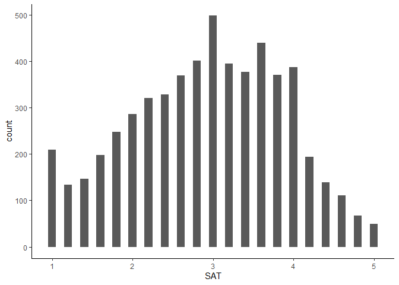

My Project
================
Varun
2024-10-10

``` r
library(psych)
library(haven)
library(dplyr)
```

    ## 
    ## Attaching package: 'dplyr'

    ## The following objects are masked from 'package:stats':
    ## 
    ##     filter, lag

    ## The following objects are masked from 'package:base':
    ## 
    ##     intersect, setdiff, setequal, union

``` r
library(ggplot2)
```

    ## 
    ## Attaching package: 'ggplot2'

    ## The following objects are masked from 'package:psych':
    ## 
    ##     %+%, alpha

\#dataset

``` r
load("C:/Users/vtrip/OneDrive/Desktop/ICPSR_38964/DS0001/38964-0001-Data.rda")
```

``` r
new_dataset <- da38964.0001 %>%
  select(RES1, RES2, RES3, RES4, RES5, RES5, RES6, SAT1, SAT2, SAT3, SAT4, SAT5, SEX, LAD_NOW, LAD_FUT)


  new_dataset$RES1 <- as.numeric(new_dataset$RES1)
  describe(new_dataset$RES1)
```

    ##    vars    n mean   sd median trimmed  mad min max range  skew kurtosis   se
    ## X1    1 7644 3.64 1.06      4    3.72 1.48   1   7     6 -0.62    -0.19 0.01

``` r
  new_dataset <- new_dataset %>%
  filter(RES1 < 6)
  summary(new_dataset$RES1)
```

    ##    Min. 1st Qu.  Median    Mean 3rd Qu.    Max. 
    ##   1.000   3.000   4.000   3.637   4.000   5.000

``` r
new_dataset<- new_dataset %>%
  mutate(gender_recode = case_when(
    SEX == "(1) Male" ~  '1',
    SEX == "(2) Female" ~ "2"
    ))
```

``` r
new_dataset$RES1 <- as.numeric(new_dataset$RES1)
  
#describe(new_dataset$RES1)
#summary(new_dataset$RES1)
  
new_dataset <- new_dataset %>%
  filter(RES1 < 6)

new_dataset$RES2 <- as.numeric(new_dataset$RES2)
  

new_dataset <- new_dataset %>%
  filter(RES2 < 6)

#describe(new_dataset$RES2)  
#summary(new_dataset$RES2)

new_dataset$RES3 <- as.numeric(new_dataset$RES3)
  
new_dataset <- new_dataset %>%
  filter(RES3 < 6)

#describe(new_dataset$RES3)  
#summary(new_dataset$RES3)

new_dataset$RES4 <- as.numeric(new_dataset$RES4)
  
new_dataset <- new_dataset %>%
  filter(RES4 < 6)

#describe(new_dataset$RES4)  
#summary(new_dataset$RES4)

new_dataset$RES5 <- as.numeric(new_dataset$RES5)
  
new_dataset <- new_dataset %>%
  filter(RES5 < 6)

#describe(new_dataset$RES5)  
#summary(new_dataset$RES5)

new_dataset$RES6 <- as.numeric(new_dataset$RES6)
  
new_dataset <- new_dataset %>%
  filter(RES6 < 6)

#describe(new_dataset$RES6)  
#summary(new_dataset$RES6)

new_dataset$SAT1 <- as.numeric(new_dataset$SAT1)
  
new_dataset <- new_dataset %>%
  filter(SAT1 < 6)

#describe(new_dataset$SAT1)  
#summary(new_dataset$SAT1)

new_dataset$SAT2 <- as.numeric(new_dataset$SAT2)
  
new_dataset <- new_dataset %>%
  filter(SAT2 < 6)

#describe(new_dataset$SAT2)  
#summary(new_dataset$SAT2)

new_dataset$SAT3 <- as.numeric(new_dataset$SAT3)
  
new_dataset <- new_dataset %>%
  filter(SAT3 < 6)

#describe(new_dataset$SAT3)  
#summary(new_dataset$SAT3)

new_dataset$SAT4 <- as.numeric(new_dataset$SAT4)
  
new_dataset <- new_dataset %>%
  filter(SAT4 < 6)

#describe(new_dataset$SAT4)  
#summary(new_dataset$SAT4)

new_dataset$SAT5 <- as.numeric(new_dataset$SAT5)
  
new_dataset <- new_dataset %>%
  filter(SAT5 < 6)

#describe(new_dataset$SAT5)  
#summary(new_dataset$SAT5)

new_dataset$LAD_NOW <- as.numeric(new_dataset$LAD_NOW)
  
new_dataset <- new_dataset %>%
  filter(LAD_NOW < 11)

#describe(new_dataset$LAD_NOW)  
#summary(new_dataset$LAD_NOW)

new_dataset$LAD_FUT <- as.numeric(new_dataset$LAD_FUT)
  
new_dataset <- new_dataset %>%
  filter(LAD_FUT < 11)

#describe(new_dataset$LAD_FUT)  
#summary(new_dataset$LAD_FUT)

#code to calculate social ladder variable
new_dataset$MOB_EXPECT<- new_dataset$LAD_FUT - new_dataset$LAD_NOW
```

``` r
#composite variables

new_dataset <- new_dataset %>%
  mutate(RES = round(rowMeans(cbind(RES1, RES2, RES3, RES4, RES5, RES6)), 1))

new_dataset <- new_dataset %>%
  mutate(SAT = round(rowMeans(cbind(SAT1, SAT2, SAT3, SAT4, SAT5)), 2))
```

``` r
#summary descriptive statistics

new_dataset %>% 
  group_by(SEX) %>%
  dplyr::summarize(
      mean_RES   = mean(RES),
      mean_SAT    = mean(SAT),
      std_dev_RES = sd(RES),
      std_dev_SAT = sd(SAT),
      corr_RES_SAT  = cor(RES, SAT)
)
```

    ## # A tibble: 3 × 6
    ##   SEX        mean_RES mean_SAT std_dev_RES std_dev_SAT corr_RES_SAT
    ##   <fct>         <dbl>    <dbl>       <dbl>       <dbl>        <dbl>
    ## 1 (1) Male       3.06     2.94       0.388       0.964       0.0766
    ## 2 (2) Female     3.09     2.91       0.377       0.939       0.0931
    ## 3 (3) Other      3.11     2.43       0.424       1.09        0.150

``` r
#Weak positive correlation between resilience and satisfaction when grouped by sex, where the correlation is slightly stronger in females. 
```

``` r
#data distribution visualization


ggplot(new_dataset, aes(x = SEX, y = RES)) + geom_violin(aes(fill=SEX)) + scale_fill_manual(values = c("Male" = "blue", "Female" = "pink")) + theme_classic()
```

    ## Warning: No shared levels found between `names(values)` of the manual scale and the
    ## data's fill values.
    ## No shared levels found between `names(values)` of the manual scale and the
    ## data's fill values.

<!-- -->

``` r
ggplot(new_dataset, aes(x = SEX, y = SAT)) + geom_violin(aes(fill=SEX)) + scale_fill_manual(values = c("Male" = "blue", "Female" = "pink")) + theme_classic()
```

    ## Warning: No shared levels found between `names(values)` of the manual scale and the
    ## data's fill values.
    ## No shared levels found between `names(values)` of the manual scale and the
    ## data's fill values.

<!-- -->

``` r
violinBy(SAT ~ SEX, data = new_dataset, rain= TRUE, vertical = FALSE)
```

<!-- -->

``` r
ggplot(new_dataset, aes(x = RES)) + geom_histogram(binwidth = 0.1) + theme_classic()
```

<!-- -->

``` r
ggplot(new_dataset, aes(x = SAT)) + geom_histogram(binwidth = 0.1) + theme_classic()
```

<!-- -->

``` r
#Normality test for SAT, Shapiro

#shapiro.test(new_dataset$SAT)

#shapiro.test(new_dataset$RES)
```

``` r
new_dataset$SAT_log <- log10(new_dataset$SAT)

ggplot(new_dataset, aes(x = SAT_log)) + geom_histogram(binwidth = 0.05) + theme_classic()
```

<!-- -->

``` r
new_dataset$RES_log <- log10(new_dataset$RES)

ggplot(new_dataset, aes(x = RES_log)) + geom_histogram(binwidth = 0.05) + theme_classic()
```

<!-- -->

``` r
#shapiro.test(new_dataset$SAT_log)
#shapiro.test(new_dataset$RES_log)

#Based on the original histograms, RES seemed normal & SAT did not. Based on the S-W normality test, both were non-normal. Remained so depite log transformation
```

``` r
ggplot(new_dataset, aes(x = SEX, y = SAT)) +
  geom_boxplot(aes(fill = SEX)) +
  theme_minimal() +
  labs(title = "Boxplot of SAT Scores by Sex", x = "Sex", y = "SAT Scores")
```

<!-- -->

``` r
#variance by group for variables RES & SAT

var(new_dataset$RES)
```

    ## [1] 0.1468334

``` r
new_dataset %>%
  group_by(SEX) %>%
  summarize(Variance = var(RES))
```

    ## # A tibble: 3 × 2
    ##   SEX        Variance
    ##   <fct>         <dbl>
    ## 1 (1) Male      0.151
    ## 2 (2) Female    0.142
    ## 3 (3) Other     0.180

``` r
var(new_dataset$SAT)
```

    ## [1] 0.9085259

``` r
new_dataset %>%
  group_by(SEX) %>%
  summarize(Variance = var(SAT))
```

    ## # A tibble: 3 × 2
    ##   SEX        Variance
    ##   <fct>         <dbl>
    ## 1 (1) Male      0.930
    ## 2 (2) Female    0.882
    ## 3 (3) Other     1.20

``` r
ggplot(new_dataset, aes(x = SEX, y = MOB_EXPECT)) +
  geom_boxplot(aes(fill = SEX)) +
  theme_minimal() +
  labs(title = "MOB_EXPECT by SEX", x = "Sex", y = "MOB_EXPECT")
```

<!-- -->

``` r
correlation <- cor(new_dataset$MOB_EXPECT, new_dataset$SAT, use = "complete.obs")

print(correlation)
```

    ## [1] -0.2168215

``` r
#counterintuitively, there seems to be a negative correlation between life satisfaction and expecttions of mobility. 
```
