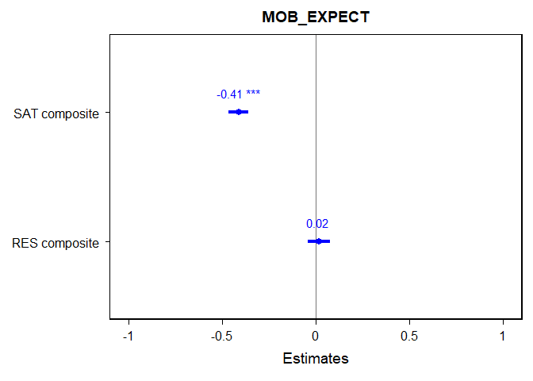
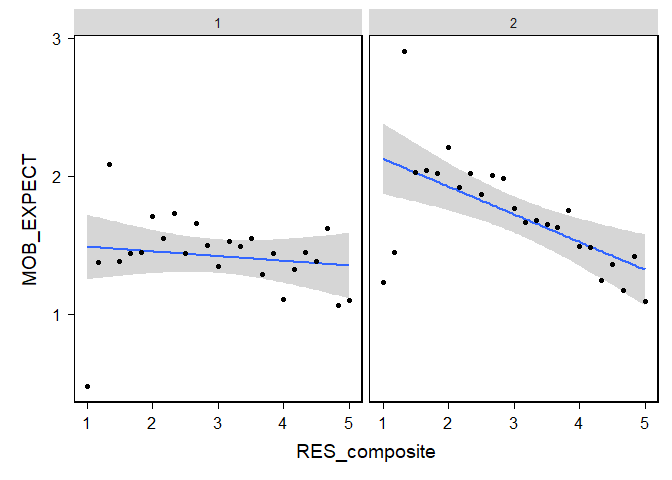
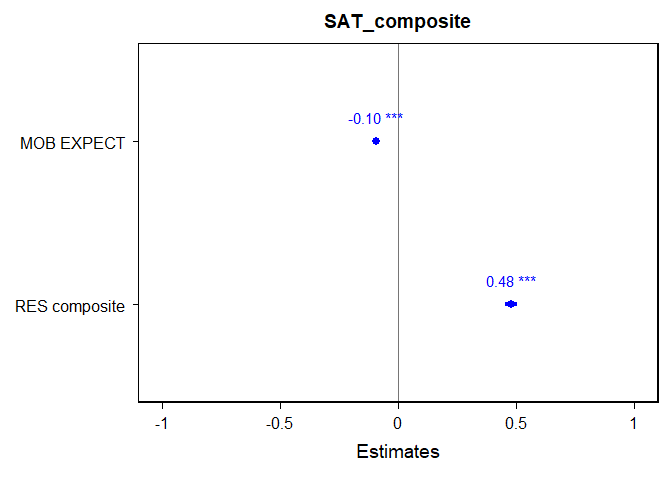

My Project
================
Varun
2024-10-10

``` r
library(psych)
library(haven)
library(dplyr)
```

    ## 
    ## Attaching package: 'dplyr'

    ## The following objects are masked from 'package:stats':
    ## 
    ##     filter, lag

    ## The following objects are masked from 'package:base':
    ## 
    ##     intersect, setdiff, setequal, union

``` r
library(ggplot2)
```

    ## 
    ## Attaching package: 'ggplot2'

    ## The following objects are masked from 'package:psych':
    ## 
    ##     %+%, alpha

``` r
library(bruceR)
```

    ## 
    ## bruceR (v2024.6)
    ## Broadly Useful Convenient and Efficient R functions
    ## 
    ## Packages also loaded:
    ## ✔ data.table ✔ emmeans
    ## ✔ dplyr      ✔ lmerTest
    ## ✔ tidyr      ✔ effectsize
    ## ✔ stringr    ✔ performance
    ## ✔ ggplot2    ✔ interactions
    ## 
    ## Main functions of `bruceR`:
    ## cc()             Describe()  TTEST()
    ## add()            Freq()      MANOVA()
    ## .mean()          Corr()      EMMEANS()
    ## set.wd()         Alpha()     PROCESS()
    ## import()         EFA()       model_summary()
    ## print_table()    CFA()       lavaan_summary()
    ## 
    ## For full functionality, please install all dependencies:
    ## install.packages("bruceR", dep=TRUE)
    ## 
    ## Online documentation:
    ## https://psychbruce.github.io/bruceR
    ## 
    ## To use this package in publications, please cite:
    ## Bao, H.-W.-S. (2024). bruceR: Broadly useful convenient and efficient R functions (Version 2024.6) [Computer software]. https://CRAN.R-project.org/package=bruceR

    ## 
    ## These packages are dependencies of `bruceR` but not installed:
    ## - pacman, openxlsx, ggtext, lmtest, vars, phia, MuMIn, GGally
    ## 
    ## ***** Install all dependencies *****
    ## install.packages("bruceR", dep=TRUE)

``` r
library(performance)
library(sjPlot)
library(ggstatsplot)
```

    ## You can cite this package as:
    ##      Patil, I. (2021). Visualizations with statistical details: The 'ggstatsplot' approach.
    ##      Journal of Open Source Software, 6(61), 3167, doi:10.21105/joss.03167

``` r
library(Rmisc)
```

    ## Loading required package: lattice

    ## Loading required package: plyr

    ## ------------------------------------------------------------------------------

    ## You have loaded plyr after dplyr - this is likely to cause problems.
    ## If you need functions from both plyr and dplyr, please load plyr first, then dplyr:
    ## library(plyr); library(dplyr)

    ## ------------------------------------------------------------------------------

    ## 
    ## Attaching package: 'plyr'

    ## The following objects are masked from 'package:dplyr':
    ## 
    ##     arrange, count, desc, failwith, id, mutate, rename, summarise,
    ##     summarize

``` r
library(tidyverse)
```

    ## ── Attaching core tidyverse packages ──────────────────────── tidyverse 2.0.0 ──
    ## ✔ forcats   1.0.0     ✔ readr     2.1.5
    ## ✔ lubridate 1.9.3     ✔ tibble    3.2.1
    ## ✔ purrr     1.0.2

    ## ── Conflicts ────────────────────────────────────────── tidyverse_conflicts() ──
    ## ✖ ggplot2::%+%()        masks psych::%+%()
    ## ✖ ggplot2::alpha()      masks psych::alpha()
    ## ✖ plyr::arrange()       masks dplyr::arrange()
    ## ✖ data.table::between() masks dplyr::between()
    ## ✖ purrr::compact()      masks plyr::compact()
    ## ✖ plyr::count()         masks dplyr::count()
    ## ✖ plyr::desc()          masks dplyr::desc()
    ## ✖ Matrix::expand()      masks tidyr::expand()
    ## ✖ plyr::failwith()      masks dplyr::failwith()
    ## ✖ dplyr::filter()       masks stats::filter()
    ## ✖ data.table::first()   masks dplyr::first()
    ## ✖ lubridate::hour()     masks data.table::hour()
    ## ✖ plyr::id()            masks dplyr::id()
    ## ✖ lubridate::isoweek()  masks data.table::isoweek()
    ## ✖ dplyr::lag()          masks stats::lag()
    ## ✖ data.table::last()    masks dplyr::last()
    ## ✖ lubridate::mday()     masks data.table::mday()
    ## ✖ lubridate::minute()   masks data.table::minute()
    ## ✖ lubridate::month()    masks data.table::month()
    ## ✖ plyr::mutate()        masks dplyr::mutate()
    ## ✖ Matrix::pack()        masks tidyr::pack()
    ## ✖ lubridate::quarter()  masks data.table::quarter()
    ## ✖ plyr::rename()        masks dplyr::rename()
    ## ✖ lubridate::second()   masks data.table::second()
    ## ✖ plyr::summarise()     masks dplyr::summarise()
    ## ✖ plyr::summarize()     masks dplyr::summarize()
    ## ✖ purrr::transpose()    masks data.table::transpose()
    ## ✖ Matrix::unpack()      masks tidyr::unpack()
    ## ✖ lubridate::wday()     masks data.table::wday()
    ## ✖ lubridate::week()     masks data.table::week()
    ## ✖ lubridate::yday()     masks data.table::yday()
    ## ✖ lubridate::year()     masks data.table::year()
    ## ℹ Use the conflicted package (<http://conflicted.r-lib.org/>) to force all conflicts to become errors

\#dataset

``` r
load("C:/Users/vtrip/OneDrive/Desktop/ICPSR_38964/DS0001/38964-0001-Data.rda")
```

``` r
new_dataset <- da38964.0001 %>%
  select(RES1, RES2, RES3, RES4, RES5, RES5, RES6, SAT1, SAT2, SAT3, SAT4, SAT5, SEX, LAD_NOW, LAD_FUT)
```

``` r
#new_dataset<- new_dataset %>%
#  mutate(gender_recode = case_when(
#    SEX == "(1) Male" ~  '1',
#    SEX == "(2) Female" ~ "2"
#    ))
```

``` r
new_dataset$SEX <- as.numeric(new_dataset$SEX)

new_dataset <- new_dataset %>%
  filter(SEX < 3)

new_dataset$RES1 <- as.numeric(new_dataset$RES1)
  


#describe(new_dataset$RES1)
#summary(new_dataset$RES1)

  
new_dataset <- new_dataset %>%
  filter(RES1 < 6)

new_dataset$RES2 <- as.numeric(new_dataset$RES2)
  

new_dataset <- new_dataset %>%
  filter(RES2 < 6)


new_dataset$RES2_R <- 6 - new_dataset$RES2

#describe(new_dataset$RES2)  
#summary(new_dataset$RES2)

new_dataset$RES3 <- as.numeric(new_dataset$RES3)
  
new_dataset <- new_dataset %>%
  filter(RES3 < 6)

#describe(new_dataset$RES3)  
#summary(new_dataset$RES3)

new_dataset$RES4 <- as.numeric(new_dataset$RES4)
  
new_dataset <- new_dataset %>%
  filter(RES4 < 6)

new_dataset$RES4_R <- 6 - new_dataset$RES4

#describe(new_dataset$RES4)  
#summary(new_dataset$RES4)

new_dataset$RES5 <- as.numeric(new_dataset$RES5)
  
new_dataset <- new_dataset %>%
  filter(RES5 < 6)

#describe(new_dataset$RES5)  
#summary(new_dataset$RES5)

new_dataset$RES6 <- as.numeric(new_dataset$RES6)
  
new_dataset <- new_dataset %>%
  filter(RES6 < 6)

new_dataset$RES6_R <- 6 - new_dataset$RES6

#describe(new_dataset$RES6)  
#summary(new_dataset$RES6)

new_dataset$SAT1 <- as.numeric(new_dataset$SAT1)
  
new_dataset <- new_dataset %>%
  filter(SAT1 < 6)

#describe(new_dataset$SAT1)  
#summary(new_dataset$SAT1)

new_dataset$SAT2 <- as.numeric(new_dataset$SAT2)
  
new_dataset <- new_dataset %>%
  filter(SAT2 < 6)

#describe(new_dataset$SAT2)  
#summary(new_dataset$SAT2)

new_dataset$SAT3 <- as.numeric(new_dataset$SAT3)
  
new_dataset <- new_dataset %>%
  filter(SAT3 < 6)

#describe(new_dataset$SAT3)  
#summary(new_dataset$SAT3)

new_dataset$SAT4 <- as.numeric(new_dataset$SAT4)
  
new_dataset <- new_dataset %>%
  filter(SAT4 < 6)

#describe(new_dataset$SAT4)  
#summary(new_dataset$SAT4)

new_dataset$SAT5 <- as.numeric(new_dataset$SAT5)
  
new_dataset <- new_dataset %>%
  filter(SAT5 < 6)

#describe(new_dataset$SAT5)  
#summary(new_dataset$SAT5)

new_dataset$LAD_NOW <- as.numeric(new_dataset$LAD_NOW)
  
new_dataset <- new_dataset %>%
  filter(LAD_NOW < 11)

#describe(new_dataset$LAD_NOW)  
#summary(new_dataset$LAD_NOW)

new_dataset$LAD_FUT <- as.numeric(new_dataset$LAD_FUT)
  
new_dataset <- new_dataset %>%
  filter(LAD_FUT < 11)

#describe(new_dataset$LAD_FUT)  
#summary(new_dataset$LAD_FUT)

#code to calculate social ladder variable
new_dataset$MOB_EXPECT<- new_dataset$LAD_FUT - new_dataset$LAD_NOW
```

``` r
#composite variables

#new_dataset <- new_dataset %>%
  #mutate(RES = rbind(rowMeans(cbind(RES1, RES2, RES3, RES4, RES5, RES6))))

#new_dataset <- new_dataset %>%
  #mutate(SAT = rbind(rowMeans(cbind(SAT1, SAT2, SAT3, SAT4, SAT5))))

new_dataset <- new_dataset %>%
  mutate(RES_composite = rowMeans(cbind(RES1, RES2_R, RES3, RES4_R, RES5, RES6_R)))

new_dataset <- new_dataset %>%
  mutate(SAT_composite = rowMeans(cbind(SAT1, SAT2, SAT3, SAT4, SAT5)))
```

``` r
#summary descriptive statistics

new_dataset %>% 
  group_by(SEX) %>%
  dplyr::summarize(
     mean_RES   = mean(RES_composite),
     mean_SAT    = mean(SAT_composite),
     std_dev_RES = sd(RES_composite),
     std_dev_SAT = sd(SAT_composite),
     corr_RES_SAT  = cor(RES_composite, SAT_composite)
)
```

    ## # A tibble: 2 × 6
    ##     SEX mean_RES mean_SAT std_dev_RES std_dev_SAT corr_RES_SAT
    ##   <dbl>    <dbl>    <dbl>       <dbl>       <dbl>        <dbl>
    ## 1     1     3.30     2.94       0.822       0.964        0.464
    ## 2     2     3.08     2.91       0.823       0.939        0.406

``` r
#Weak positive correlation between resilience and satisfaction when grouped by sex, where the correlation is slightly stronger in females. 
```

``` r
#data distribution visualization


#ggplot(new_dataset, aes(x = SEX, y = RES)) + geom_violin(aes(fill=SEX)) + scale_fill_manual(values = c("Male" = "blue", "Female" = "pink")) + theme_classic()

#ggplot(new_dataset, aes(x = SEX, y = SAT)) + geom_violin(aes(fill=SEX)) + scale_fill_manual(values = c("Male" = "blue", "Female" = "pink")) + theme_classic()
```

``` r
#violinBy(SAT ~ SEX, data = new_dataset, rain= TRUE, vertical = FALSE)
```

``` r
#str(new_dataset)
#mo<-lm(data = new_dataset, MOB_EXPECT ~ RES_composite + SAT_composite)

#check_model(mo)


#ggplot(new_dataset, aes(x = RES_composite)) + geom_histogram(binwidth = 0.1) + theme_classic()

#ggplot(new_dataset, aes(x = SAT_composite)) + geom_histogram(binwidth = 0.1) + theme_classic()
```

``` r
#Normality test for SAT, Shapiro

#shapiro.test(new_dataset$SAT)

#shapiro.test(new_dataset$RES)
```

``` r
#new_dataset$SAT_log <- log10(new_dataset$SAT)

#ggplot(new_dataset, aes(x = SAT_log)) + geom_histogram(binwidth = 0.05) + theme_classic()

#new_dataset$RES_log <- log10(new_dataset$RES)

#ggplot(new_dataset, aes(x = RES_log)) + geom_histogram(binwidth = 0.05) + theme_classic()
```

``` r
#shapiro.test(new_dataset$SAT_log)
#shapiro.test(new_dataset$RES_log)

#Based on the original histograms, RES seemed normal & SAT did not. Based on the S-W normality test, both were non-normal. Remained so depite log transformation
```

``` r
#ggplot(new_dataset, aes(x = SEX, y = SAT)) +
 # geom_boxplot(aes(fill = SEX)) +
  #theme_minimal() +
  #labs(title = "Boxplot of SAT Scores by Sex", x = "Sex", y = "SAT Scores")
```

``` r
#variance by group for variables RES & SAT

#var(new_dataset$RES)

#new_dataset %>%
 # group_by(SEX) %>%
  #summarize(Variance = var(RES))

#var(new_dataset$SAT)
```

``` r
#new_dataset %>%
 # group_by(SEX) %>%
  #summarize(Variance = var(SAT))
```

``` r
#ggplot(new_dataset, aes(x = SEX, y = MOB_EXPECT)) +
 # geom_boxplot(aes(fill = SEX)) +
  #theme_minimal() +
  #labs(title = "MOB_EXPECT by SEX", x = "Sex", y = "MOB_EXPECT")
```

``` r
#correlation <- cor(new_dataset$MOB_EXPECT, new_dataset$SAT, use = "complete.obs")

#print(correlation)
```

``` r
#simple correlation using ALL variables 

new_dataset <- new_dataset %>%
  select(SAT_composite, MOB_EXPECT, RES_composite, SEX)


Corr(new_dataset)
```

    ## Pearson's r and 95% confidence intervals:
    ## ────────────────────────────────────────────────────────────────
    ##                                  r       [95% CI]     p        N
    ## ────────────────────────────────────────────────────────────────
    ## SAT_composite-MOB_EXPECT     -0.22 [-0.24, -0.19] <.001 *** 5635
    ## SAT_composite-RES_composite   0.43 [ 0.41,  0.45] <.001 *** 5635
    ## SAT_composite-SEX            -0.02 [-0.04,  0.01]  .180     5635
    ## MOB_EXPECT-RES_composite     -0.09 [-0.11, -0.06] <.001 *** 5635
    ## MOB_EXPECT-SEX                0.10 [ 0.07,  0.12] <.001 *** 5635
    ## RES_composite-SEX            -0.13 [-0.16, -0.11] <.001 *** 5635
    ## ────────────────────────────────────────────────────────────────

<!-- -->

    ## Correlation matrix is displayed in the RStudio `Plots` Pane.

``` r
ggcorrmat(new_dataset)
```

<!-- -->

``` r
#Multiple regression

model<-lm(MOB_EXPECT ~ SEX + SAT_composite + RES_composite, data = new_dataset)

check_model(model)
```

<!-- -->

``` r
model_summary(model)
```

    ## 
    ## Model Summary
    ## 
    ## ─────────────────────────────
    ##                (1) MOB_EXPECT
    ## ─────────────────────────────
    ## (Intercept)       2.159 ***  
    ##                  (0.128)     
    ## SEX               0.339 ***  
    ##                  (0.047)     
    ## SAT_composite    -0.426 ***  
    ##                  (0.027)     
    ## RES_composite     0.053      
    ##                  (0.031)     
    ## ─────────────────────────────
    ## R^2               0.056      
    ## Adj. R^2          0.056      
    ## Num. obs.      5635          
    ## ─────────────────────────────
    ## Note. * p < .05, ** p < .01, *** p < .001.
    ## 
    ## # Check for Multicollinearity
    ## 
    ## Low Correlation
    ## 
    ##           Term  VIF   VIF 95% CI Increased SE Tolerance Tolerance 95% CI
    ##            SEX 1.02 [1.01, 1.08]         1.01      0.98     [0.93, 0.99]
    ##  SAT_composite 1.23 [1.20, 1.27]         1.11      0.81     [0.78, 0.83]
    ##  RES_composite 1.26 [1.22, 1.30]         1.12      0.80     [0.77, 0.82]

``` r
tab_model(model)
```

<table style="border-collapse:collapse; border:none;">
<tr>
<th style="border-top: double; text-align:center; font-style:normal; font-weight:bold; padding:0.2cm;  text-align:left; ">
 
</th>
<th colspan="3" style="border-top: double; text-align:center; font-style:normal; font-weight:bold; padding:0.2cm; ">
MOB_EXPECT
</th>
</tr>
<tr>
<td style=" text-align:center; border-bottom:1px solid; font-style:italic; font-weight:normal;  text-align:left; ">
Predictors
</td>
<td style=" text-align:center; border-bottom:1px solid; font-style:italic; font-weight:normal;  ">
Estimates
</td>
<td style=" text-align:center; border-bottom:1px solid; font-style:italic; font-weight:normal;  ">
CI
</td>
<td style=" text-align:center; border-bottom:1px solid; font-style:italic; font-weight:normal;  ">
p
</td>
</tr>
<tr>
<td style=" padding:0.2cm; text-align:left; vertical-align:top; text-align:left; ">
(Intercept)
</td>
<td style=" padding:0.2cm; text-align:left; vertical-align:top; text-align:center;  ">
2.16
</td>
<td style=" padding:0.2cm; text-align:left; vertical-align:top; text-align:center;  ">
1.91 – 2.41
</td>
<td style=" padding:0.2cm; text-align:left; vertical-align:top; text-align:center;  ">
<strong>\<0.001</strong>
</td>
</tr>
<tr>
<td style=" padding:0.2cm; text-align:left; vertical-align:top; text-align:left; ">
SEX
</td>
<td style=" padding:0.2cm; text-align:left; vertical-align:top; text-align:center;  ">
0.34
</td>
<td style=" padding:0.2cm; text-align:left; vertical-align:top; text-align:center;  ">
0.25 – 0.43
</td>
<td style=" padding:0.2cm; text-align:left; vertical-align:top; text-align:center;  ">
<strong>\<0.001</strong>
</td>
</tr>
<tr>
<td style=" padding:0.2cm; text-align:left; vertical-align:top; text-align:left; ">
SAT composite
</td>
<td style=" padding:0.2cm; text-align:left; vertical-align:top; text-align:center;  ">
-0.43
</td>
<td style=" padding:0.2cm; text-align:left; vertical-align:top; text-align:center;  ">
-0.48 – -0.37
</td>
<td style=" padding:0.2cm; text-align:left; vertical-align:top; text-align:center;  ">
<strong>\<0.001</strong>
</td>
</tr>
<tr>
<td style=" padding:0.2cm; text-align:left; vertical-align:top; text-align:left; ">
RES composite
</td>
<td style=" padding:0.2cm; text-align:left; vertical-align:top; text-align:center;  ">
0.05
</td>
<td style=" padding:0.2cm; text-align:left; vertical-align:top; text-align:center;  ">
-0.01 – 0.11
</td>
<td style=" padding:0.2cm; text-align:left; vertical-align:top; text-align:center;  ">
0.089
</td>
</tr>
<tr>
<td style=" padding:0.2cm; text-align:left; vertical-align:top; text-align:left; padding-top:0.1cm; padding-bottom:0.1cm; border-top:1px solid;">
Observations
</td>
<td style=" padding:0.2cm; text-align:left; vertical-align:top; padding-top:0.1cm; padding-bottom:0.1cm; text-align:left; border-top:1px solid;" colspan="3">
5635
</td>
</tr>
<tr>
<td style=" padding:0.2cm; text-align:left; vertical-align:top; text-align:left; padding-top:0.1cm; padding-bottom:0.1cm;">
R<sup>2</sup> / R<sup>2</sup> adjusted
</td>
<td style=" padding:0.2cm; text-align:left; vertical-align:top; padding-top:0.1cm; padding-bottom:0.1cm; text-align:left;" colspan="3">
0.056 / 0.056
</td>
</tr>
</table>

``` r
plot_model(model,  type ="est",  show.values = TRUE, vline.color = "#1B191999", line.size = 1.5, dot.size = 2.5, colors = "blue") + theme_bruce()
```

<!-- -->

``` r
#moderation effect of GENDER on correlation between SAT_composite and MOB_expect


PROCESS(new_dataset, y = "MOB_EXPECT", x = "SAT_composite", mods = c("SEX"))
```

    ## 
    ## ****************** PART 1. Regression Model Summary ******************
    ## 
    ## PROCESS Model Code : 1 (Hayes, 2018; www.guilford.com/p/hayes3)
    ## PROCESS Model Type : Simple Moderation
    ## -    Outcome (Y) : MOB_EXPECT
    ## -  Predictor (X) : SAT_composite
    ## -  Mediators (M) : -
    ## - Moderators (W) : SEX
    ## - Covariates (C) : -
    ## -   HLM Clusters : -
    ## 
    ## All numeric predictors have been grand-mean centered.
    ## (For details, please see the help page of PROCESS.)
    ## 
    ## Formula of Outcome:
    ## -    MOB_EXPECT ~ SAT_composite*SEX
    ## 
    ## CAUTION:
    ##   Fixed effect (coef.) of a predictor involved in an interaction
    ##   denotes its "simple effect/slope" at the other predictor = 0.
    ##   Only when all predictors in an interaction are mean-centered
    ##   can the fixed effect denote the "main effect"!
    ##   
    ## Model Summary
    ## 
    ## ─────────────────────────────────────────────────
    ##                    (1) MOB_EXPECT  (2) MOB_EXPECT
    ## ─────────────────────────────────────────────────
    ## (Intercept)           1.593 ***       1.591 ***  
    ##                      (0.023)         (0.023)     
    ## SAT_composite        -0.409 ***      -0.408 ***  
    ##                      (0.024)         (0.024)     
    ## SEX                                   0.328 ***  
    ##                                      (0.046)     
    ## SAT_composite:SEX                    -0.126 **   
    ##                                      (0.049)     
    ## ─────────────────────────────────────────────────
    ## R^2                   0.047           0.057      
    ## Adj. R^2              0.047           0.056      
    ## Num. obs.          5635            5635          
    ## ─────────────────────────────────────────────────
    ## Note. * p < .05, ** p < .01, *** p < .001.
    ## 
    ## ************ PART 2. Mediation/Moderation Effect Estimate ************
    ## 
    ## Package Use : ‘interactions’ (v1.2.0)
    ## Effect Type : Simple Moderation (Model 1)
    ## Sample Size : 5635
    ## Random Seed : -
    ## Simulations : -
    ## 
    ## Interaction Effect on "MOB_EXPECT" (Y)
    ## ────────────────────────────────────────────
    ##                         F df1  df2     p    
    ## ────────────────────────────────────────────
    ## SAT_composite * SEX  6.75   1 5631  .009 ** 
    ## ────────────────────────────────────────────
    ## 
    ## Simple Slopes: "SAT_composite" (X) ==> "MOB_EXPECT" (Y)
    ## ────────────────────────────────────────────────────────
    ##  "SEX" Effect    S.E.       t     p             [95% CI]
    ## ────────────────────────────────────────────────────────
    ##  1.000 -0.343 (0.034) -10.015 <.001 *** [-0.411, -0.276]
    ##  2.000 -0.470 (0.035) -13.609 <.001 *** [-0.537, -0.402]
    ## ────────────────────────────────────────────────────────

``` r
PROCESS(new_dataset, y = "MOB_EXPECT", x = "RES_composite", mods = c("SEX"))
```

    ## 
    ## ****************** PART 1. Regression Model Summary ******************
    ## 
    ## PROCESS Model Code : 1 (Hayes, 2018; www.guilford.com/p/hayes3)
    ## PROCESS Model Type : Simple Moderation
    ## -    Outcome (Y) : MOB_EXPECT
    ## -  Predictor (X) : RES_composite
    ## -  Mediators (M) : -
    ## - Moderators (W) : SEX
    ## - Covariates (C) : -
    ## -   HLM Clusters : -
    ## 
    ## All numeric predictors have been grand-mean centered.
    ## (For details, please see the help page of PROCESS.)
    ## 
    ## Formula of Outcome:
    ## -    MOB_EXPECT ~ RES_composite*SEX
    ## 
    ## CAUTION:
    ##   Fixed effect (coef.) of a predictor involved in an interaction
    ##   denotes its "simple effect/slope" at the other predictor = 0.
    ##   Only when all predictors in an interaction are mean-centered
    ##   can the fixed effect denote the "main effect"!
    ##   
    ## Model Summary
    ## 
    ## ─────────────────────────────────────────────────
    ##                    (1) MOB_EXPECT  (2) MOB_EXPECT
    ## ─────────────────────────────────────────────────
    ## (Intercept)           1.593 ***       1.585 ***  
    ##                      (0.024)         (0.024)     
    ## RES_composite        -0.186 ***      -0.161 ***  
    ##                      (0.029)         (0.029)     
    ## SEX                                   0.306 ***  
    ##                                      (0.048)     
    ## RES_composite:SEX                    -0.129 *    
    ##                                      (0.058)     
    ## ─────────────────────────────────────────────────
    ## R^2                   0.007           0.015      
    ## Adj. R^2              0.007           0.015      
    ## Num. obs.          5635            5635          
    ## ─────────────────────────────────────────────────
    ## Note. * p < .05, ** p < .01, *** p < .001.
    ## 
    ## ************ PART 2. Mediation/Moderation Effect Estimate ************
    ## 
    ## Package Use : ‘interactions’ (v1.2.0)
    ## Effect Type : Simple Moderation (Model 1)
    ## Sample Size : 5635
    ## Random Seed : -
    ## Simulations : -
    ## 
    ## Interaction Effect on "MOB_EXPECT" (Y)
    ## ────────────────────────────────────────────
    ##                         F df1  df2     p    
    ## ────────────────────────────────────────────
    ## RES_composite * SEX  5.04   1 5631  .025 *  
    ## ────────────────────────────────────────────
    ## 
    ## Simple Slopes: "RES_composite" (X) ==> "MOB_EXPECT" (Y)
    ## ───────────────────────────────────────────────────────
    ##  "SEX" Effect    S.E.      t     p             [95% CI]
    ## ───────────────────────────────────────────────────────
    ##  1.000 -0.095 (0.041) -2.311  .021 *   [-0.176, -0.014]
    ##  2.000 -0.224 (0.040) -5.573 <.001 *** [-0.303, -0.145]
    ## ───────────────────────────────────────────────────────

``` r
plot<-summarySE(new_dataset, measurevar="MOB_EXPECT", groupvars=c("SEX", "SAT_composite"))


ggplot(plot, aes(x = SAT_composite, y = MOB_EXPECT)) +
  geom_smooth(method = lm) + geom_point() + facet_wrap(~ SEX) + theme_bruce()
```

    ## `geom_smooth()` using formula = 'y ~ x'

<!-- -->

``` r
plot<-summarySE(new_dataset, measurevar="MOB_EXPECT", groupvars=c("SEX", "RES_composite"))

ggplot(plot, aes(x = RES_composite, y = MOB_EXPECT)) +
  geom_smooth(method = lm) + geom_point() + facet_wrap(~ SEX) + theme_bruce()
```

    ## `geom_smooth()` using formula = 'y ~ x'

<!-- -->

``` r
Alpha(da38964.0001, "SAT", c("1", "2", "3", "4", "5"))
```

    ## 
    ## Reliability Analysis
    ## 
    ## Summary:
    ## Total Items: 5
    ## Scale Range: 1 ~ 7
    ## Total Cases: 7644
    ## Valid Cases: 7644 (100.0%)
    ## 
    ## Scale Statistics:
    ## Mean = 3.085
    ## S.D. = 0.994
    ## Cronbach’s α = 0.864
    ## McDonald’s ω = 0.870
    ## 
    ## Item Statistics (Cronbach’s α If Item Deleted):
    ## ───────────────────────────────────────────────
    ##        Mean    S.D. Item-Rest Cor. Cronbach’s α
    ## ───────────────────────────────────────────────
    ## SAT1  3.032 (1.190)          0.731        0.824
    ## SAT2  3.038 (1.190)          0.734        0.824
    ## SAT3  3.268 (1.245)          0.775        0.812
    ## SAT4  3.365 (1.217)          0.663        0.841
    ## SAT5  2.723 (1.329)          0.539        0.874
    ## ───────────────────────────────────────────────
    ## Item-Rest Cor. = Corrected Item-Total Correlation

``` r
Alpha(da38964.0001, "RES", 1:6, rev = c("RES2", "RES4", "RES6"))
```

    ## 
    ## Reliability Analysis
    ## 
    ## Summary:
    ## Total Items: 6
    ## Scale Range: 1 ~ 7
    ## Total Cases: 7644
    ## Valid Cases: 7644 (100.0%)
    ## 
    ## Scale Statistics:
    ## Mean = 4.290
    ## S.D. = 0.846
    ## Cronbach’s α = 0.843
    ## McDonald’s ω = 0.844
    ## 
    ## Item Statistics (Cronbach’s α If Item Deleted):
    ## ─────────────────────────────────────────────────────
    ##              Mean    S.D. Item-Rest Cor. Cronbach’s α
    ## ─────────────────────────────────────────────────────
    ## RES1        3.638 (1.055)          0.608        0.820
    ## RES2 (rev)  5.075 (1.191)          0.605        0.821
    ## RES3        3.299 (1.134)          0.652        0.811
    ## RES4 (rev)  5.274 (1.173)          0.675        0.806
    ## RES5        3.199 (1.074)          0.509        0.838
    ## RES6 (rev)  5.258 (1.155)          0.681        0.805
    ## ─────────────────────────────────────────────────────
    ## Item-Rest Cor. = Corrected Item-Total Correlation

``` r
EFA(da38964.0001, "SAT", 1:5, method = "pa", plot.scree = TRUE, nfactors = c("parallel"))
```

    ## 
    ## Explanatory Factor Analysis
    ## 
    ## Summary:
    ## Total Items: 5
    ## Scale Range: 1 ~ 7
    ## Total Cases: 7644
    ## Valid Cases: 7644 (100.0%)
    ## 
    ## Extraction Method:
    ## - Principal Axis Factor Analysis
    ## Rotation Method:
    ## - (Only one component was extracted. The solution was not rotated.)
    ## 
    ## KMO and Bartlett's Test:
    ## - Kaiser-Meyer-Olkin (KMO) Measure of Sampling Adequacy: MSA = 0.861
    ## - Bartlett's Test of Sphericity: Approx. χ²(10) = 18324.56, p < 1e-99 ***
    ## 
    ## Total Variance Explained:
    ## ───────────────────────────────────────────────────────────────────────────────
    ##           Eigenvalue Variance % Cumulative % SS Loading Variance % Cumulative %
    ## ───────────────────────────────────────────────────────────────────────────────
    ## Factor 1       3.280     65.601       65.601      2.887     57.741       57.741
    ## Factor 2       0.633     12.670       78.271                                   
    ## Factor 3       0.484      9.682       87.954                                   
    ## Factor 4       0.320      6.406       94.360                                   
    ## Factor 5       0.282      5.640      100.000                                   
    ## ───────────────────────────────────────────────────────────────────────────────
    ## 
    ## Factor Loadings (Sorted by Size):
    ## ───────────────────────
    ##         PA1 Communality
    ## ───────────────────────
    ## SAT3  0.858       0.737
    ## SAT2  0.812       0.659
    ## SAT1  0.806       0.649
    ## SAT4  0.716       0.512
    ## SAT5  0.574       0.330
    ## ───────────────────────
    ## Communality = Sum of Squared (SS) Factor Loadings
    ## (Uniqueness = 1 - Communality)

<!-- -->

``` r
EFA(da38964.0001, "RES", 1:6, rev = c("RES2", "RES4", "RES6"), method = "pa", plot.scree = TRUE, nfactors = c("parallel"))
```

    ## 
    ## Explanatory Factor Analysis
    ## 
    ## Summary:
    ## Total Items: 6
    ## Scale Range: 1 ~ 7
    ## Total Cases: 7644
    ## Valid Cases: 7644 (100.0%)
    ## 
    ## Extraction Method:
    ## - Principal Axis Factor Analysis
    ## Rotation Method:
    ## - (Only one component was extracted. The solution was not rotated.)
    ## 
    ## KMO and Bartlett's Test:
    ## - Kaiser-Meyer-Olkin (KMO) Measure of Sampling Adequacy: MSA = 0.866
    ## - Bartlett's Test of Sphericity: Approx. χ²(15) = 16512.63, p < 1e-99 ***
    ## 
    ## Total Variance Explained:
    ## ───────────────────────────────────────────────────────────────────────────────
    ##           Eigenvalue Variance % Cumulative % SS Loading Variance % Cumulative %
    ## ───────────────────────────────────────────────────────────────────────────────
    ## Factor 1       3.367     56.124       56.124      2.858     47.642       47.642
    ## Factor 2       0.781     13.020       69.144                                   
    ## Factor 3       0.576      9.602       78.746                                   
    ## Factor 4       0.453      7.549       86.295                                   
    ## Factor 5       0.447      7.444       93.739                                   
    ## Factor 6       0.376      6.261      100.000                                   
    ## ───────────────────────────────────────────────────────────────────────────────
    ## 
    ## Factor Loadings (Sorted by Size):
    ## ─────────────────────────────
    ##               PA1 Communality
    ## ─────────────────────────────
    ## RES6 (rev)  0.758       0.575
    ## RES4 (rev)  0.753       0.566
    ## RES3        0.718       0.515
    ## RES2 (rev)  0.668       0.447
    ## RES1        0.668       0.446
    ## RES5        0.556       0.309
    ## ─────────────────────────────
    ## Communality = Sum of Squared (SS) Factor Loadings
    ## (Uniqueness = 1 - Communality)

<!-- -->
